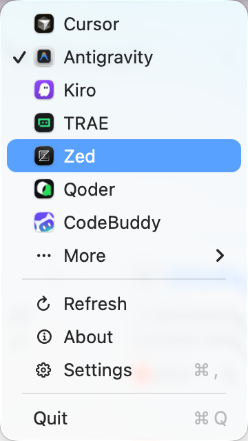

<div align="center">

# Default Editor Switcher

[English](README.md) · **简体中文** · [日本語](README.ja-JP.md)

**一个轻巧顺手的 macOS 菜单栏工具，给那些已经进入 Vibe Coding 时代、电脑里常备好几个 AI 编辑器的开发者。**

**一键把 `.py`、`.tsx`、`.html`、`.css`、`.java`、`.md` 这类文件的默认打开方式一起切到另一款编辑器，不用再去 Finder 里按类型逐个修改，既繁琐，也很容易漏掉。**

</div>

<p align="center">
  
</p>

## 项目缘起

到了 Vibe Coding 这一步，很少有人只靠一个编辑器干完一天的活。Cursor 跑一个任务，Windsurf 跑另一个，Zed 负责更轻的回路，VS Code 或 JetBrains 接住特定语言和工作模式。并发处理不同类型的任务时，Mac 上常驻好几个编辑器，早就成了常态。

真正麻烦的不是装了多少编辑器，而是默认打开方式总得跟着切。这个任务更适合另一个编辑器，另一个任务已经在别处跑着，或者 token 配额刚好见底，只能临时换工具。`Default Editor Switcher` 就是为这种高频切换准备的：把一组常见代码和文本文件的默认打开方式一次切过去。这样你从 Finder 或 Git 工具里点开文件时，它会更自然地落到当前想用的编辑器，而不是打断另一个已经打开的工作区；等你切到另一个项目、想换一套编辑器习惯时，也不用再回头把 `Open With` 一项项收尾。

它借鉴了 [`default-browser-switcher`](https://github.com/congbo/default-browser-switcher) 那种干脆的切换体验，只是这次目标从浏览器变成了编辑器。

## 你可以做什么

- 直接在菜单栏展示当前全局文本默认编辑器。
- 支持 refresh 可用编辑器列表，重新发现内置推荐编辑器和 macOS 已声明可处理目标类型的应用。
- 一键切换内置的全局文本默认编辑器。
- 提供原生设置窗口，用于配置开机启动、菜单栏推荐应用顺序，以及应用语言。

## 常见问题排查

### macOS 提示“应用已损坏，无法打开”？

由于 macOS 会对非 App Store 下载的应用执行 quarantine 安全检查，你第一次打开应用时可能会看到这条提示。

1. 命令行修复（推荐）：

   ```bash
   sudo xattr -rd com.apple.quarantine "/Applications/DefaultEditorSwitcher.app"
   ```

   如果你移动过应用位置，或者改过应用名称，请按实际路径调整这条命令。

2. 或者：打开“系统设置” -> “隐私与安全性”，点击“仍要打开”。

## 本地开发

构建：

```bash
xcodebuild -scheme DefaultEditorSwitcher -project DefaultEditorSwitcher.xcodeproj -destination 'platform=macOS' build
```

测试：

```bash
xcodebuild test -scheme DefaultEditorSwitcher -project DefaultEditorSwitcher.xcodeproj -destination 'platform=macOS'
```

## License

[MIT](LICENSE)
